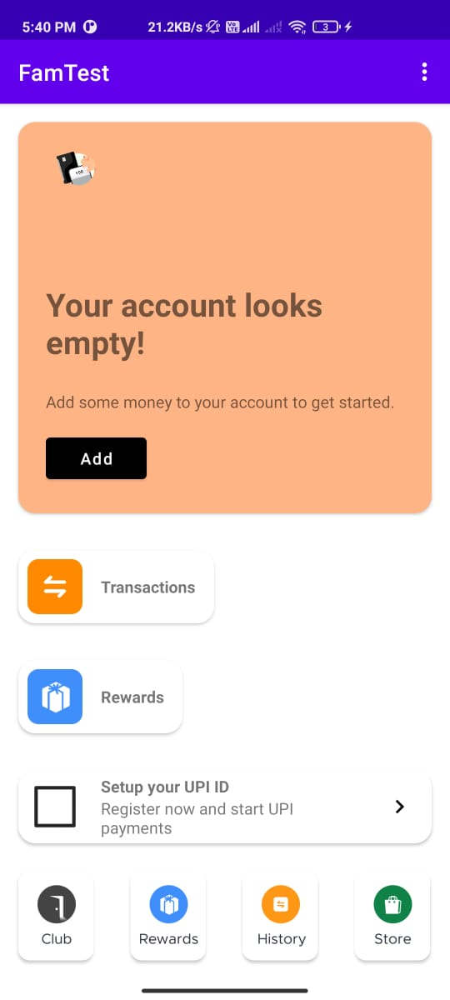
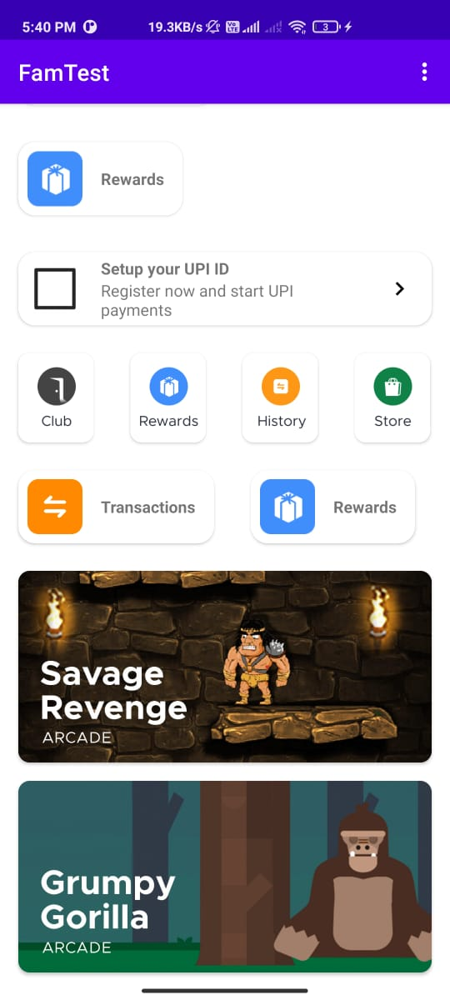

# FamTest
Assignment given by FamPay for Android Developer Role.

I've been really fortunate to have this opportunity. Given my best.

## What is the task?
- Create an app which renders _ContextualCards_ based on Web-Service API response.

## How I have built it?
- I have created a plugable view called CardsComponent, which just needs to be initialized from the fragment to attach and takes context.
  It automatically observers the lifecycle of the root fragment, fetches the data and attaches the cards on root fragment's root view.
  
### Known bugs
1) Cards are not sliding _Horizontally_ because some misconfiguration in NetstedScrollView with Horizontal Linear Layout.
- I could have used Horizontal RecyclerView instead, but didn't due to time constraints

2) No loading screen, API Error screen
- I have already took so much of time, that's why didn't wanted to make it late even more.

## Screenshots
____________
